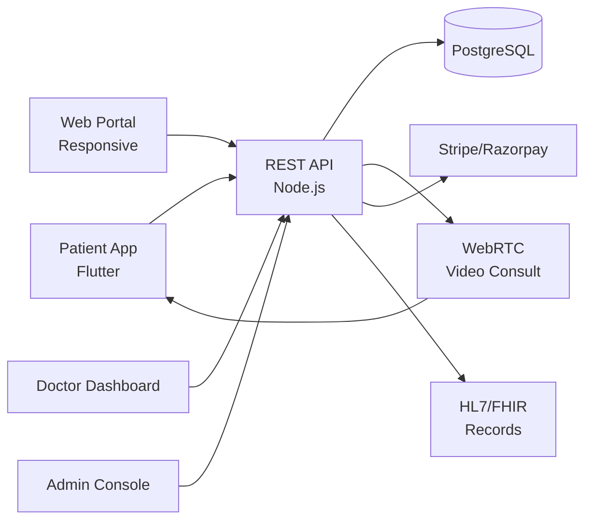

# Practo Clone — White-Label Healthcare & Telemedicine Platform by Miracuves

**MXDoc** is a production-ready, white-label Practo clone: a complete telemedicine platform with patient, doctor, and admin panels — delivered with **100% source code ownership** in **6 working days**.

> 🏥 **See it running before you talk to anyone.** Live patient app, doctor dashboard, and admin console — demo credentials are printed on the [solution page](https://miracuves.com/practo-clone#demo). No sales call required.

---

## 🚀 Live Demos

| Environment | URL | What you can test |
|---|---|---|
| 📱 Patient App | [mas.mimeld.com](https://mas.mimeld.com) | Search doctors, book, video consult, e-prescription |
| 🌐 Web Portal | [mxdoc.mimeld.com](https://mxdoc.mimeld.com) | Full patient experience in the browser |
| 👨⚕️ Doctor Dashboard | [Solution page → Demo](https://miracuves.com/practo-clone#demo) | Schedule, patients, e-Rx, analytics |
| 🛠️ Admin Console | [Solution page → Demo](https://miracuves.com/practo-clone#demo) | Doctors, appointments, pharmacy, analytics |

Demo credentials for all environments: **[miracuves.com/practo-clone → Demo section](https://miracuves.com/practo-clone/#demo)**

---

## ✨ What Makes This Practo Clone Different

Most telemedicine scripts stop at "video call a doctor." This platform ships with the features that actually run a healthcare *business*:

- **E-Prescription Built In** — digital prescriptions with QR-code verification, drug-interaction checks, and pharmacy routing
- **Telemedicine Stack** — WebRTC video consult with chat fallback, recording-with-consent, and async consult — same stack Practo & Lybrate use
- **Lab-Booking Aggregator** — home-sample pickup, lab network, e-reports inside the app — what makes 1mg & Pharmeasy stick
- **Pharmacy Routing** — scripts routed to nearest partner pharmacy for delivery — full-stack e-health, not just consults
- **HIPAA-Ready Logging** — every patient touch-point logged with audit trail, encryption at rest, and role-based access

## 📦 Core Features

**Patient:** search doctors · book in-clinic & video consult · e-prescription · medical records · lab bookings · medicine orders · wallet · health reminders

**Doctor:** profile & specialisation · schedule & slot management · video consult · e-prescription · patient records · reviews · payouts · analytics

**Admin:** doctor verification · appointment oversight · pharmacy onboarding · commission engine · analytics reports

## 🏗️ Architecture

**Stack:** Flutter mobile apps · Node.js/Java backend · PostgreSQL · WebRTC for video consult · Stripe & regional gateways · HL7/FHIR-compatible records API · Stripe, Razorpay, regional gateways, insurance integrations

## 📋 What’s Included

- ✅ Full source code — backend, web, mobile apps, panels (no encryption, no license locks)
- ✅ Deployment to your servers & app store submission assistance
- ✅ Your branding — white-label rename, logo, colors, domain
- ✅ 60 days post-launch support + 12 months of free updates
- ✅ Documentation & handover

**Pricing:** from **$2,899**, transparent on the [solution page](https://miracuves.com/practo-clone/#pricing) — no "contact us for quote" games.

## 🆚 Why Not Build From Scratch?

Custom healthcare platforms run $80k–$400k and 6–14 months. A proven white-label base gets you to market in 6 working days for a fraction of that, with your budget preserved for doctor onboarding and compliance review.

## 📚 Resources

- 📖 [Practo Clone — Full Solution Page](https://miracuves.com/practo-clone) (features, pricing, demos, FAQ)
- 💰 [How Much Does a Telemedicine App Cost in 2026?](https://miracuves.com/practo-clone#pricing) pricing breakdown & what's included
- 📝 [Best Practo Clone Script in 2026](https://miracuves.com/practo-clone/blog/) features, pricing & launch guide
- 🧠 [Telemedicine Compliance: HIPAA, ABDM & Beyond](https://miracuves.com/practo-clone/blog/) jurisdiction rules, audit trails
- ✅ [Miracuves Facts & Claims Ledger](https://miracuves.com/practo-clone/facts/) every claim we make, verified

## 🏢 About Miracuves

[Miracuves Solutions](https://miracuves.com) builds white-label clone apps and custom software from Mumbai, India — 90+ ready-made solutions, live demos for every product, transparent pricing, and delivery in 6 working days. Operating since 2010.

**Talk to us:** [WhatsApp](https://wa.me/919830009649) · [Schedule a consultation](https://miracuves.com/schedule-consultation/) · [miracuves.com](https://miracuves.com)

---

### ⚠️ Note on This Repository

This repository is a product overview. The full source code is delivered to clients on purchase — see [what’s included](https://miracuves.com/practo-clone/#included). For a hands-on evaluation, use the live demos above; credentials are public on the solution page.

*Keywords: practo clone, practo clone script, telemedicine, online doctor, healthcare app, white label Practo, e-prescription, Flutter healthcare app, Node.js health*

---

<!--
══════════════════════════════════════════════════
TEMPLATE VARIABLE KEY — auto-generated from Netflix-Clone pattern
══════════════════════════════════════════════════
{APP_NAME}        Practo Clone
{MX_NAME}         MXDoc
{CATEGORY}        Healthcare & Telemedicine Platform
{DEMO_WEB}        mxdoc.mimeld.com
{PRICE}           $2,899
{SLUG}            practo-clone
{SOLUTION_URL}    https://miracuves.com/practo-clone/
{VERTICAL}        healthcare

See /tmp/verticals/healthcare.txt for the vertical config used to generate this README.
══════════════════════════════════════════════════
-->